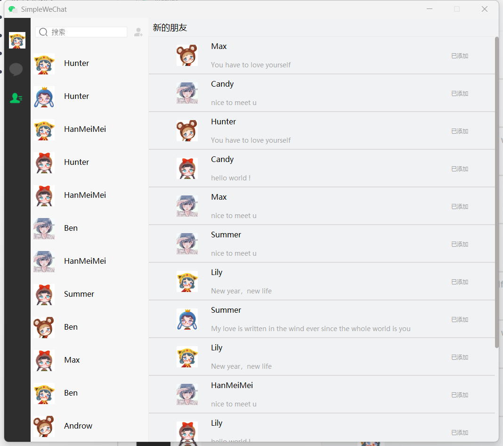

# 仿微信界面的全栈聊天项目

## 项目简介
本项目仅仅用于个人学习提升。客户端使用QT5模仿微信界面，实现添加好友，好友聊天等功能，客户端和服务端之间通过短链接http或长连接tcp进行通信，服务端采用了分布式的设计

服务端仓库地址 https://github.com/UnsterblichW/SimpleChatServer

## 项目平台
1. 客户端：Qt 5.12.2 ，构建文件使用qmake，构建套件使用 Desktop Qt 5.15.2 MinGW 32-bit / Desktop Qt 5.15.2 MinGW 64-bit （编译器为MINGW 8.1.0），C++ 11
2. 服务端：Visual Studio 2022，使用sln项目构建，平台工具集 Visual Studio 2022(v143)，C++语言标准 std:C++17

## 项目所用技术
1. 客户端界面的实现中大量运用到Qt的信号槽机制，元对象机制，使用MVC的设计思想来实现聊天对话框等需要展现数据的界面，使用QSS来美化界面。支持添加好友，展示好友列表，好友之间聊天，查看好友信息等功能；
2. 后端采用分布式设计，分为GateServer网关服务，多个ChatServer聊天服务，StatusServer状态服务以及VerifyServer验证服务；
3. 核心框架采用boost库提供的asio进行封装，采用多线程模式封装iocontext池提升并发性能；
4. 服务端的实现引入了多种广泛使用的开源库，利用gRPC在各个职责的服务器之间通信，利用mysqlconnector连接mysql数据库对用户数据进行持久化处理，利用hiredis连接redis作为缓存数据来提升服务端性能；
5. 在本项目中大量使用了池化设计，实现了数据库连接池，grpc连接池，iocontext连接池，充分利用现代CPU的多核优势；

## 项目展示

